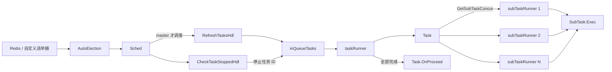

# looptask

`looptask` 是一个分布式循环任务调度框架。它通过主节点选举保证同一时刻只有 master 节点负责调度任务，并将一个业务任务拆分成多个子任务并行执行。它适合 watch、巡检、扫描、同步、补偿、持续推进型任务等场景。

## 1. 设计目标

- 支持集群主节点选举，避免多节点重复调度同一批任务。
- 周期性刷新任务列表，自动发现新增任务。
- 支持手动添加和删除任务。
- 支持全局任务并发限制。
- 支持任务组维度的并发限制。
- 支持单个任务内部拆分多个子任务并行执行。
- 支持子任务按返回间隔循环执行和有限次数重试。
- 支持周期性检查已停止任务并主动移除。

## 2. 目录结构

```text
looptask/
├── go.mod
├── loop_task.go       # 调度器、任务运行器、子任务运行器
├── loop_task_test.go  # 使用示例测试
└── README.md          # 技术文档
```

## 3. 核心概念

### 3.1 Sched

`Sched` 是调度器，负责：

- 维护任务队列 `inQueueTasks`。
- 维护运行中任务 `runningTasks`。
- 管理全局并发和任务组并发。
- 周期性刷新任务。
- 周期性检查任务是否停止。
- 根据 master 状态决定是否执行调度。
- 启动 `taskRunner` 执行具体任务。

### 3.2 Task

`Task` 表示一个业务任务，由用户实现。

```go
type Task interface {
	Ready() bool
	GetSubTaskConcur() uint32
	NextBatchSubTasks() []SubTask
	OnProceed()
}
```

方法说明：

| 方法 | 说明 |
| --- | --- |
| `Ready()` | 任务开始执行前的准备检查，返回 `false` 时任务不执行 |
| `GetSubTaskConcur()` | 返回该任务内部允许启动的子任务 runner 数量 |
| `NextBatchSubTasks()` | 每个子任务 runner 启动前调用一次，返回该 runner 要执行的一批子任务 |
| `OnProceed()` | 所有子任务正常完成后调用 |

### 3.3 SubTask

`SubTask` 是任务内部的最小执行单元，由用户实现。

```go
type SubTask interface {
	Exec() (nextInterval time.Duration, retry bool)
}
```

`Exec()` 返回值：

- `nextInterval`：本次执行完成后，当前子任务 runner 下一轮执行前等待多久。
- `retry`：是否把该子任务重新放回当前 runner 的队尾。

### 3.4 taskRunner

`taskRunner` 负责一个 `Task` 的完整生命周期：

1. 调用 `NewTaskHdl(taskId, taskGrp)` 创建任务实例。
2. 调用 `task.Ready()` 判断是否可以执行。
3. 根据 `task.GetSubTaskConcur()` 创建多个 `subTaskRunner`。
4. 等待所有 `subTaskRunner` 完成。
5. 正常完成时调用 `task.OnProceed()`。
6. 被停止时通知所有子任务 runner 退出。

### 3.5 subTaskRunner

`subTaskRunner` 持有一组 `SubTask`，按队列顺序逐个执行：

1. 从队首取出一个子任务。
2. 调用 `Exec()`。
3. 如果返回 `retry=true` 且未超过 `SubTaskMaxAttempt`，把该子任务追加到队尾。
4. 按 `nextInterval` 等待。
5. 继续执行下一个子任务，直到队列为空或收到停止信号。

## 4. 配置项

`NewSched` 通过 `SchedCfg` 创建调度器。

| 字段 | 必填 | 说明 |
| --- | --- | --- |
| `Name` | 是 | 调度器名称，也用于默认 Redis 选举器的 key |
| `ConcurTaskMax` | 建议必填 | 全局最大并发任务数；为 `0` 时不会调度任务 |
| `GrpConcurTaskMax` | 否 | 默认任务组最大并发数；为 `0` 表示不限制 |
| `NewTaskHdl` | 是 | 根据 `taskId` 和 `taskGrp` 创建 `Task` 实例 |
| `RefreshTasksHdl` | 是 | 周期性返回任务组到任务 ID 列表的映射 |
| `CheckTaskStoppedHdl` | 是 | 检查哪些任务需要停止 |
| `RefreshTaskIntervalMs` | 否 | 刷新任务列表间隔，默认 `5000` 毫秒 |
| `CheckTasksStopIntervalMs` | 否 | 检查任务停止间隔，默认 `5000` 毫秒 |
| `SubTaskMaxAttempt` | 建议必填 | 子任务最大执行次数；`1` 表示只执行一次，不重试 |
| `Elect` | 二选一 | 自定义选举器 |
| `ElectRedis` | 二选一 | 默认 Redis 分布式锁选举器使用的连接池 |
| `OnErr` | 否 | 错误回调，内部会包装调用栈 |

`NewSched` 会校验 `Name`、`NewTaskHdl`、`RefreshTasksHdl`、`CheckTaskStoppedHdl` 和选举器配置。没有传入 `Elect` 时，必须提供 `ElectRedis`。

## 5. 调度架构



## 6. 运行流程

1. 调用 `NewSched(cfg)` 创建调度器。
2. 调度器初始化选举循环。
3. 调用 `sched.Run()` 启动后台调度循环。
4. 调度器启动后会立即尝试触发一次任务刷新。
5. 调度循环每次处理前会检查当前节点是否为 master。
6. master 节点按配置周期调用 `RefreshTasksHdl()` 刷新任务列表。
7. 新任务进入 `inQueueTasks`。
8. `schedNewTask` 根据 `ConcurTaskMax` 和任务组并发限制决定是否启动任务。
9. 任务启动后进入 `runningTasks`，并由 `taskRunner` 执行。
10. `taskRunner` 创建多个 `subTaskRunner` 并等待它们完成。
11. 任务完成后释放任务组并发计数。
12. `cleanStoppedTasks` 周期性清理已经结束的 runner，并触发重新调度。

## 7. 并发控制

### 7.1 全局任务并发

`ConcurTaskMax` 控制同时运行的任务数量。

```go
ConcurTaskMax: 3
```

表示最多同时运行 3 个 `Task`。超过上限的任务会留在 `inQueueTasks` 中等待后续 `reSchedule()`。

注意：`ConcurTaskMax` 为 `0` 时，调度器不会启动任何任务。

### 7.2 默认任务组并发

`GrpConcurTaskMax` 控制同一个 `taskGrp` 内最多同时运行多少个任务。

```go
GrpConcurTaskMax: 1
```

表示每个任务组同一时间最多运行 1 个任务。

### 7.3 动态任务组并发

可以使用 `SetGrpConcur` 调整指定任务组的并发：

```go
sched.SetGrpConcur("tenant-a", 2)
sched.SetGrpConcur("tenant-b", -1)
sched.SetGrpConcur("tenant-c", 0)
```

含义：

- `2`：该任务组最多并发 2 个任务。
- `-1`：该任务组不限制并发。
- `0`：删除该任务组的自定义配置，回退到 `GrpConcurTaskMax`。

`GetGrpConcur(grp)` 会返回最终生效的并发限制和是否受限。

## 8. 子任务执行与重试

每个 `subTaskRunner` 内部维护一个子任务队列。

```text
[subtask-1, subtask-2, subtask-3]
```

执行 `subtask-1` 后：

- 如果 `retry=false`，该子任务结束。
- 如果 `retry=true` 且未超过 `SubTaskMaxAttempt`，该子任务追加到队尾。

例如：

```text
执行前: [A, B, C]
A 返回 retry=true
执行后: [B, C, A]
```

`SubTaskMaxAttempt` 表示最大执行次数，不是额外重试次数：

- `1`：最多执行 1 次。
- `2`：首次执行失败或要求重试后，最多再执行 1 次。
- `0`：当前实现下不会追加重试，效果接近只执行一次。

`nextInterval` 控制当前 runner 执行下一个子任务前等待多久：

- `nextInterval == 0`：不等待，立即进入下一轮。
- `nextInterval > 0`：创建 ticker 等待，期间可响应停止信号。

## 9. 任务刷新与停止

### 9.1 周期刷新

`RefreshTasksHdl` 返回结构：

```go
map[string][]string
```

其中：

- key 是任务组 `taskGrp`。
- value 是该组下的任务 ID 列表。

调度器会把返回的任务转换为添加事件。已存在于 `inQueueTasks` 的任务会被忽略，避免重复添加。

### 9.2 手动添加

```go
sched.Add("task-001", "tenant-a")
```

只有当前节点是 master 时才会生效。

### 9.3 手动删除

```go
sched.Del("task-001")
```

删除逻辑：

1. 从 `inQueueTasks` 中删除任务。
2. 如果任务正在运行，从 `runningTasks` 中删除。
3. 向 `taskRunner.stopCh` 发送停止信号。
4. 触发重新调度。

停止是异步的，正在执行的 `SubTask.Exec()` 不会被强制打断，只有在本次 `Exec()` 返回后才会响应停止信号。

### 9.4 周期停止检查

`CheckTaskStoppedHdl(taskIds []string)` 会收到当前 `inQueueTasks` 中的任务 ID。返回的任务 ID 会被调度器删除。

适合接入数据库、Redis、配置中心等外部状态，用于发现任务已经被业务侧取消。

## 10. 使用示例

```go
package main

import (
	"fmt"
	"time"

	"github.com/995933447/looptask"
	"github.com/gomodule/redigo/redis"
)

type DemoTask struct {
	id string
}

func (t *DemoTask) Ready() bool {
	fmt.Println("ready:", t.id)
	return true
}

func (t *DemoTask) GetSubTaskConcur() uint32 {
	return 2
}

func (t *DemoTask) NextBatchSubTasks() []looptask.SubTask {
	return []looptask.SubTask{
		&DemoSubTask{name: t.id + ":scan"},
		&DemoSubTask{name: t.id + ":sync"},
	}
}

func (t *DemoTask) OnProceed() {
	fmt.Println("done:", t.id)
}

type DemoSubTask struct {
	name      string
	attempted int
}

func (s *DemoSubTask) Exec() (time.Duration, bool) {
	s.attempted++
	fmt.Println("exec:", s.name, "attempt:", s.attempted)

	// 返回 true 表示需要重新放回队尾继续执行。
	if s.attempted < 3 {
		return time.Second, true
	}
	return 0, false
}

func main() {
	sched, err := looptask.NewSched(looptask.SchedCfg{
		Name:             "demo-loop-task",
		ConcurTaskMax:    3,
		GrpConcurTaskMax: 1,
		NewTaskHdl: func(taskId, taskGrp string) (looptask.Task, error) {
			return &DemoTask{id: taskId}, nil
		},
		RefreshTasksHdl: func() map[string][]string {
			return map[string][]string{
				"tenant-a": []string{"task-001", "task-002"},
				"tenant-b": []string{"task-003"},
			}
		},
		CheckTaskStoppedHdl: func(taskIds []string) []string {
			return nil
		},
		RefreshTaskIntervalMs:    5000,
		CheckTasksStopIntervalMs: 5000,
		SubTaskMaxAttempt:        3,
		ElectRedis:               newRedisPool(),
	})
	if err != nil {
		panic(err)
	}

	sched.Run()
	select {}
}

func newRedisPool() *redis.Pool {
	return &redis.Pool{
		MaxIdle:     2,
		IdleTimeout: 3 * time.Minute,
		Wait:        true,
		Dial: func() (redis.Conn, error) {
			return redis.Dial("tcp", "localhost:6379")
		},
	}
}
```

## 11. 适用场景

适合：

- 周期性扫描外部数据并持续处理。
- watch 类任务。
- 分租户、分业务组的后台处理。
- 需要主从选举避免重复消费的轻量分布式任务。
- 一个任务可拆成多批子任务并发推进的场景。

不适合：

- 需要毫秒级精准调度的定时任务系统。
- 需要强事务、任务持久化和失败恢复的任务平台。
- 需要强制中断正在执行函数的任务系统。
- 需要严格 FIFO 或优先级调度的队列。
- 子任务数量巨大且需要复杂负载均衡的场景。

## 12. 当前实现注意事项

- `Run()` 会启动后台 goroutine，本身很快返回。
- `Add()` 和 `Del()` 会向无缓冲 `evtCh` 发送事件；应在 `Run()` 启动后调用，否则 master 节点上可能阻塞。
- 调度循环只有在 `IsMaster()` 为 `true` 时才处理事件和定时器。
- 非 master 节点会每秒通过 `OnErr` 报告一次 `not master now`。
- `ConcurTaskMax` 没有默认值，配置为 `0` 时不会调度任务。
- `SubTaskMaxAttempt` 没有默认值，配置为 `0` 时即使 `Exec()` 返回 `retry=true` 也不会重新入队。
- `RefreshTasksHdl` 返回空 map 表示没有新增任务；返回 `nil` 会直接跳过本轮刷新。
- `NewTaskHdl` 返回错误或 `Task.Ready()` 返回 `false` 时，该任务本轮不会执行，且源码中不会自动调用 `OnErr`。
- 调度等待队列使用 Go map 遍历，待运行任务的选择顺序不是稳定 FIFO。
- 停止任务是协作式停止，不会打断正在运行的 `Exec()`。
- 当前没有公开的 `Stop()` 方法，调度器生命周期通常跟随进程。

## 13. 扩展建议

后续可以考虑增加：

- 基于 `context.Context` 的调度器停止和任务取消。
- `Exec(ctx)` 形式的子任务接口，用于更及时地响应停止。
- 对 `NewTaskHdl` 错误、`Ready=false`、任务完成、任务停止等事件增加 hook。
- 为 `ConcurTaskMax`、`SubTaskMaxAttempt` 提供更明确的默认值或校验。
- 增加任务持久化和恢复能力。
- 增加指标：master 状态、运行任务数、等待任务数、组并发、子任务执行次数、重试次数。
- 增加可自动结束的单元测试，替代示例测试中的 `select {}`。
